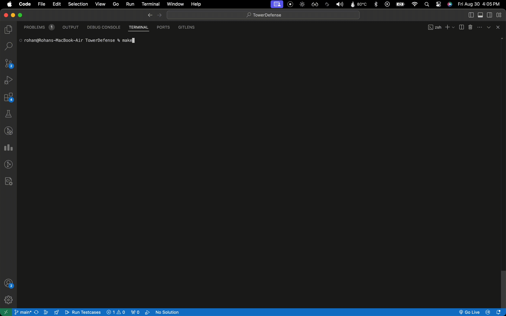

# Tower Defense Game

A classic Tower Defense game built using C++ and Raylib. Place towers, defeat waves of enemies, and manage resources to protect your base!

## Table of Contents

- [Overview](#overview)
- [Features](#features)
- [Gameplay](#gameplay)
- [Installation](#installation)
- [How to Play](#how-to-play)
- [Screenshots and GIFs](#screenshots-and-gifs)
- [Roadmap](#roadmap)


## Overview

This Tower Defense game is built using C++ and the Raylib graphics library. It allows players to strategically place towers on a map to defend against waves of enemies. Each tower has unique properties like range, damage, and fire rate, while enemies vary in speed, health, and abilities. The game includes a UI for managing resources and selecting towers.

## Features

- **Multiple Tower Types**: Choose from various towers, each with unique abilities and stats.
- **Enemy Variety**: Different enemy types with varying speeds, health, and behaviors.
- **Level Progression**: Survive waves of increasing difficulty.
- **Resource Management**: Earn resources by defeating enemies and use them to buy or upgrade towers.
- **Custom Levels**: Support for loading custom level files with `.map` extension.
- **Planned Level Editor**: A future feature allowing users to create and play their own levels.

## Gameplay

- **Defend Your Base**: Place towers strategically to stop waves of enemies.
- **Manage Resources**: Use your resources wisely to upgrade or place new towers.
- **Survive Waves**: The game ends when all waves are cleared or when your base is overrun by enemies.

## Installation

### Prerequisites

- **C++ Compiler**: Make sure you have a C++17 compatible compiler installed.
- **Raylib**: Install Raylib from [Raylib's official website](https://www.raylib.com/).

### Build Instructions

1. Clone the repository:

   ```bash
   git clone https://github.com/yourusername/TowerDefense.git
   cd TowerDefense
2. Build the project using `make`:
   ```bash
   make
3. Run the game:
   ```bash
   ./bin/main

### How to Play
- **Select a Tower**: Use the number keys (e.g `1`, `2`) to select a tower
- **Place a Tower**: Click on the map to place tower. Ensure you have enough resources
- **Survice Waves**: Enemies will spawn in waves. Use your towers to destroy them before they reach your base.
- **Manage Resources**: Earn resources by defending enemies and use them to build or upgrade towers

### Screenshots

### Roadmap
- [x] Basic tower and enemy implementation
- [x] Projectiles and UI
- [ ] Level Progression and wave management
- [ ] Additional tower and enemy types
- [ ] Polishing and animations
- [ ] Level editor tool